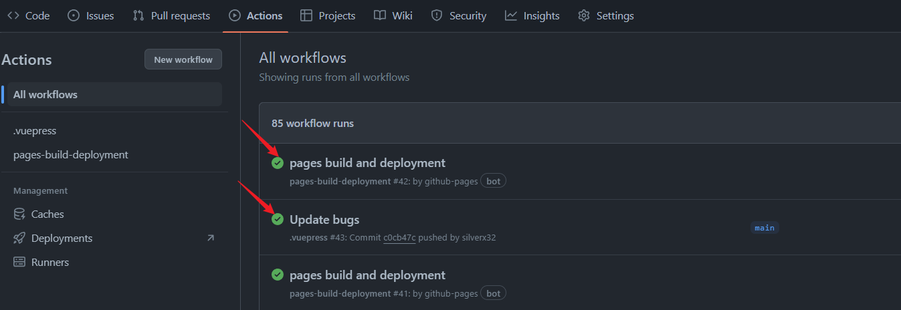
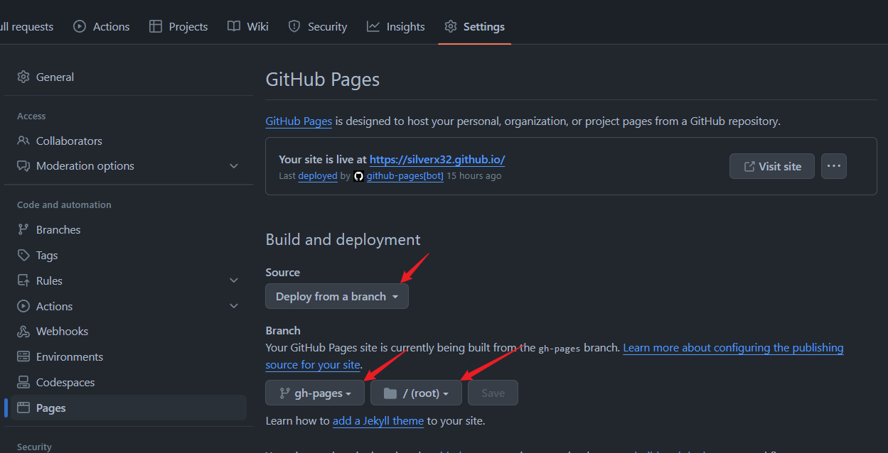

---
title: vuepress部署（就是这个网站）
date: 2023/12/28
categories:
  - 网站搭建
---

## 前期准备
1. 安装nodejs   
[nodejs官网](https://nodejs.org/en)  ~~捏马，没有中文~~  
[百度一下，你就知道](https://www.baidu.com/s?ie=UTF-8&wd=nodejs)
2. 创建文件夹
- 在本地创建一个文件夹(只要创建文件夹就行)
```bash
mkdir <文件夹名>
cd <文件夹名>
```
- 初始化git和npm
```bash
#加入git管理
git init
#初始化npm
npm init
```
3. 使用github action部署
```bash
#新建.github文件夹和workflows文件夹
mkdir .github/workflows
```
- 在workflows文件夹里新建一个docs.yml文件  
- 打开docs.yml文件，输入以下内容
```yml
name: 什么都行

on:
  # 每当 push 到 main 分支时触发部署
  
  push:
    branches: [main]
  # 手动触发部署
  workflow_dispatch:
    
#加上GithubToken权限 不然后面推送gh-pages分支会提示无权限    
permissions:
  contents: read
  pages: write
  id-token: write
  
jobs:
  docs:
    runs-on: ubuntu-latest

    steps:
      - uses: actions/checkout@v4
        with:
          # “最近更新时间” 等 git 日志相关信息，需要拉取全部提交记录
          fetch-depth: 0
 #使用github action部署
    #   - name: Setup pnpm
    #     uses: pnpm/action-setup@v2
    #     with:
    #       # 选择要使用的 pnpm 版本
    #       version: 8
    #       # 使用 pnpm 安装依赖
    #       run_install: true

    #   - name: Setup Node.js
    #     uses: actions/setup-node@v4
    #     with:
    #       # 选择要使用的 node 版本
    #       node-version: 18
    #       # 缓存 pnpm 依赖
    #       cache: pnpm

      # 运行构建脚本
    #   - name: Build VuePress site
    #     run: pnpm build
#使用github action部署End
      
      # 查看 workflow 的文档来获取更多信息
      # 推送到gh-pages分支
      # @see https://github.com/crazy-max/ghaction-github-pages
      
      - name: Deploy to GitHub Pages
        id: <你の名字>
        uses: crazy-max/ghaction-github-pages@v4
        with:
          # 部署到 gh-pages 分支
          target_branch: gh-pages
          # 部署目录为 VuePress 的默认输出目录
          build_dir: .vuepress/dist
        env:
          # @see https://docs.github.com/cn/actions/reference/authentication-in-a-workflow#about-the-github_token-secret
          GITHUB_TOKEN: ${{secrets.GITHUB_TOKEN}} 


```

## 本地部署
### 1.安装依赖  
```bash
npm install
```
### 2.安装vuepress-reco  
```bash
npx @vuepress-reco/theme-cli init
```
### 3. 配置package.json  
- 打开package.json
- 加入在最外层里加入
```json
"dependencies": {
    "vue": "^3.3.13"
  }
```
### 4. 配置.gitignore
- 加入以下内容
```
.vuepress/.cache
.vuepress/.temp
node_modules
```
### 5. 运行build
```bash
npm run build
```

### 6. 推送至github
- 仓库命名为：`<你の名字>.github.io`
- 等待github action自动部署完成
- 如图：workflows会先有一个main的进程，然后会有一个Bot的进程
  
- 等待两个进程成功

### 7. 配置github pages
- 在仓库的settings里找到github pages  
- **设置如图**

- 打开`<你の名字>.github.io`即可看到效果